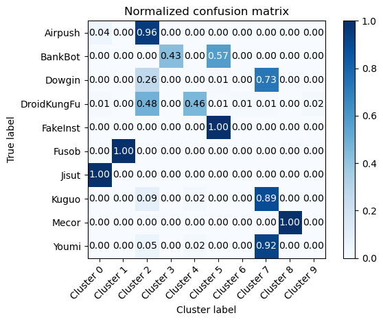
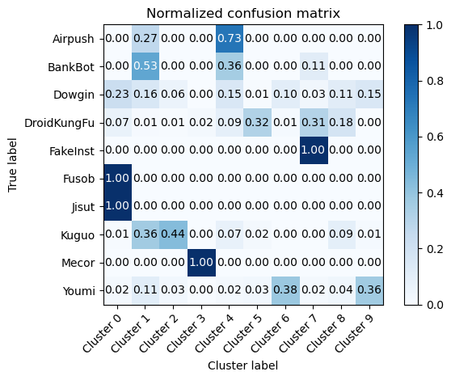
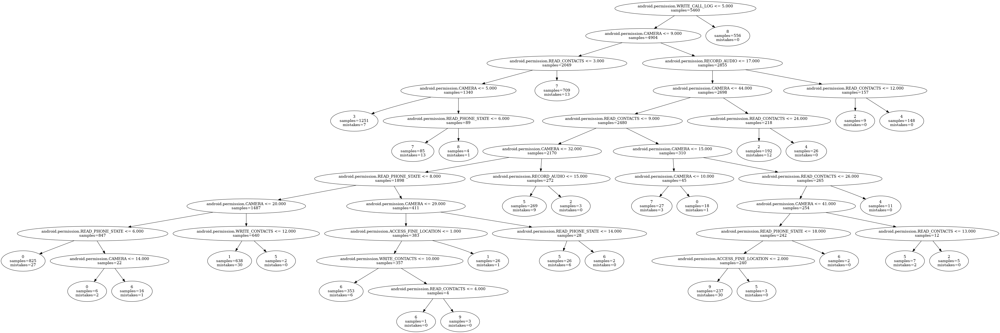

# Progress and Question

## 1. Scalar for features

### without scalar

## Clustering

before sampling
[(0, 6652), (1, 647), (2, 862), (3, 546), (4, 2168), (5, 1262), (6, 558), (7, 1197), (8, 1820), (9, 1300)]
after sampling
[(0, 546), (1, 546), (2, 546), (3, 546), (4, 546), (5, 546), (6, 546), (7, 546), (8, 546), (9, 546)]

**Similarity**
--Result of cluster 0 the largest is Jisut with 0.9479166666666666
--Result of cluster 1 the largest is Fusob with 1.0
--Result of cluster 2 the largest is Airpush with 0.5082765335929893
--Result of cluster 3 the largest is BankBot with 0.4267399267399267
--Result of cluster 4 the largest is DroidKungFu with 0.4426807760141093
--Result of cluster 5 the largest is FakeInst with 0.6275862068965518
--Result of cluster 6 the largest is DroidKungFu with 0.014571948998178506
--Result of cluster 7 the largest is Youmi with 0.3514644351464435
--Result of cluster 8 the largest is Mecor with 1.0
--Result of cluster 9 the largest is DroidKungFu with 0.020146520146520148

not distiguished
{'Kuguo', 'Dowgin'}

**Mojofm score**
85.39

## without scaler

before sampling
[(0, 6652), (1, 647), (2, 862), (3, 546), (4, 2168), (5, 1262), (6, 558), (7, 1197), (8, 1820), (9, 1300)]
after sampling
[(0, 546), (1, 546), (2, 546), (3, 546), (4, 546), (5, 546), (6, 546), (7, 546), (8, 546), (9, 546)]

**Similarity**

--Result of cluster 0 the largest is Fusob with 0.4319620253164557
--Result of cluster 1 the largest is BankBot with 0.28103946102021177
--Result of cluster 2 the largest is Kuguo with 0.39932885906040266
--Result of cluster 3 the largest is Mecor with 0.978494623655914
--Result of cluster 4 the largest is Airpush with 0.4322860238353196
--Result of cluster 5 the largest is DroidKungFu with 0.2986111111111111
--Result of cluster 6 the largest is Youmi with 0.33934426229508197
--Result of cluster 7 the largest is FakeInst with 0.6825
--Result of cluster 8 the largest is DroidKungFu with 0.14349112426035504
--Result of cluster 9 the largest is Youmi with 0.3128930817610063

not distiguished
{'Jisut', 'Dowgin'}

**Mojofm score**
66.07

### Question:不知道选择 scalar 还是不选择呢?

## 2. Tree explanation of Exkmc algorithm

### without scalar

more repeated features?

### with scalar

### Question: 还是不太会总结这个相关特征

## 3.Cltree(baseline):

**result example**

read 36 instances from data/gen.arff
attribute names: [('id', <class 'float'>), ('class', <class 'float'>), ('x0', <class 'float'>), ('x1', <class 'float'>)]
class names: ['c0', 'c1']

Cluster 0
Node:
16 instances, 0 misclassified, 100% c0, 100 relative density
Cuts {'x1', 'x0'}
x0 max: 0.690888 min: -0.586729
x1 max: 1.940884 min: -0.08176

Cluster 1
Node:
18 instances, 0 misclassified, 100% c1, 100 relative density
Cuts {'x1', 'x0'}
x0 max: 2.125444 min: 1.847681
x1 max: 2.038049 min: 1.658716

Total instances clustered: 34

可以得到相关特征 但是跑实验的过程需要很久 我放到服务器上跑 暂时还没有出结果

## 4. 论文写了 10 页 hhhhhhh
